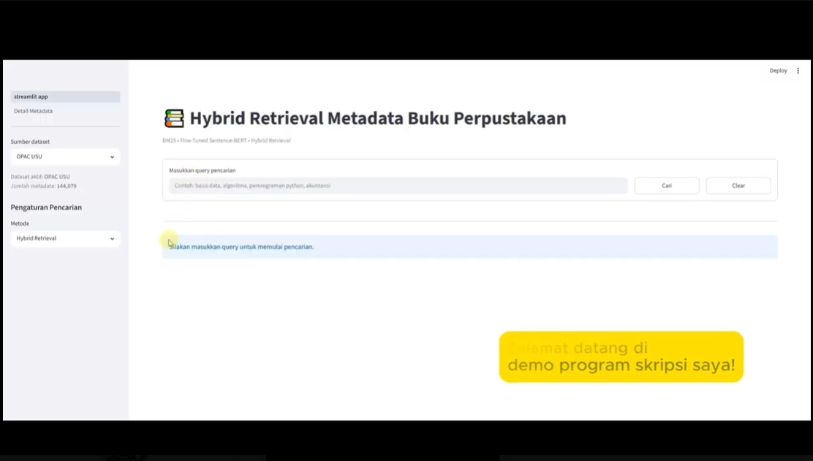

# Hybrid Retrieval System for Library Book Metadata Search

## 1. Project Overview

**Hybrid Retrieval System for Library Book Metadata Search** is an information retrieval project developed to improve book metadata search by combining **BM25 lexical retrieval** and **Fine-Tuned Sentence-BERT semantic retrieval**. The system searches library metadata using the book title and subject fields, then ranks the most relevant results through an interactive Streamlit application.

This project was built to address a common issue in library search: keyword-based search can miss relevant books when users type different terms from the metadata, while semantic search can capture meaning but still needs support from exact keyword matching. By combining both methods, this project aims to create a more relevant and practical metadata search experience.

The project is suitable for a **Data Science / NLP portfolio** because it covers data preprocessing, semantic embeddings, hybrid search, retrieval evaluation, and application development. It can also support a **Data Analyst** profile through its metric-based evaluation and search performance comparison.

---

## 2. Demo Video

)

## 3. Problem Background

Library book metadata search often depends on exact keyword matching. This can be limiting because users may search using general terms, alternative wording, or topic-based queries that do not exactly match the title or subject stored in the metadata.

To improve search relevance, this project combines three retrieval approaches:

- **BM25**, which is strong for exact keyword matching and term-based ranking.
- **Sentence-BERT**, which represents queries and metadata as dense vectors to capture semantic similarity.
- **Hybrid Retrieval**, which combines lexical and semantic scores to balance exact matching and meaning-based retrieval.

This approach helps the system retrieve results that are not only textually similar, but also semantically related to the user query.

---

## 4. Project Objectives

The objectives of this project are:

1. To build a metadata search system for library book records.
2. To preprocess book title and subject fields into searchable document text.
3. To implement BM25 as a lexical retrieval method.
4. To implement Fine-Tuned Sentence-BERT as a semantic retrieval method.
5. To combine BM25 and Sentence-BERT using a hybrid ranking strategy.
6. To evaluate retrieval performance using ranking-based metrics.
7. To implement the final retrieval system into a Streamlit web application.

---

## 5. Dataset

The main dataset used in this project consists of library book metadata. The indexed corpus contains approximately **144 thousand metadata records**, with the main searchable fields including:

| Field | Description |
|---|---|
| `judul_buku` | Book title used as one of the main searchable fields. |
| `subjek` | Book subject/category used to support topic-based retrieval. |
| `document_text` | Combined and cleaned text from title and subject fields. |
| `doc_id` | Unique identifier used to connect search results with display metadata. |

The application also supports an additional book dataset and user-uploaded CSV datasets. For uploaded datasets, the system allows users to select title and subject/category columns, preprocess the text, build a BM25 index, and generate Sentence-BERT embeddings.

---

## 6. Tools and Technologies

| Category | Tools / Technologies |
|---|---|
| Programming Language | Python |
| Web Application | Streamlit |
| Data Processing | Pandas, NumPy |
| Visualization | Matplotlib |
| Lexical Retrieval | BM25 / `rank-bm25` |
| Semantic Retrieval | Sentence-BERT / `sentence-transformers` |
| Deep Learning Backend | PyTorch |
| Text Processing | Regex, Unicode normalization |
| Model Output | Dense embeddings, cosine similarity |
| Version Control | GitHub |

---

## 7. End-to-End Project Process

### 7.1 Metadata Preparation

The metadata was prepared by selecting relevant fields, mainly book title and subject. These fields were cleaned and combined into a single `document_text` field so that every book record could be indexed and searched consistently.

Text preprocessing includes converting text to lowercase, normalizing Unicode characters, removing unnecessary symbols, replacing multiple spaces, and combining title and subject into one searchable text.

### 7.2 BM25 Lexical Retrieval

BM25 was implemented to retrieve metadata based on exact term matching. This method is useful when users search using keywords that appear directly in the title or subject field.

The BM25 configuration used in the application includes:

| Parameter | Value |
|---|---:|
| `k1` | 1.2 |
| `b` | 0.50 |

### 7.3 Fine-Tuned Sentence-BERT Semantic Retrieval

Sentence-BERT was used to represent queries and metadata as dense vectors. This allows the system to retrieve metadata based on semantic similarity, not only exact keyword overlap.

The application uses precomputed document embeddings so semantic retrieval can run faster during application runtime. Instead of generating embeddings for all documents every time a search is performed, the system only needs to encode the user query and compare it with the stored document embeddings.

### 7.4 Hybrid Retrieval Strategy

Hybrid Retrieval combines BM25 and Fine-Tuned Sentence-BERT scores. The system first retrieves candidate results, normalizes lexical and semantic scores, then combines them into a final hybrid score.

The final configuration used in the application is:

| Parameter | Value | Description |
|---|---:|---|
| `ALPHA` | 0.70 | Weight for semantic score in hybrid ranking. |
| `POOL_K` | 50 | Number of candidate results used before final ranking. |
| `TOP_K` | 50 | Number of final results returned by the system. |
| `RRF_K` | 60 | Reciprocal Rank Fusion constant used as a tie-breaker. |

The hybrid approach is designed to balance the strength of BM25 in exact keyword matching and Sentence-BERT in meaning-based matching.

### 7.5 Retrieval Evaluation

The retrieval system was evaluated using ranking-based information retrieval metrics. These metrics help measure how relevant the search results are and how well the system ranks relevant metadata at the top of the result list.

| Metric | Purpose |
|---|---|
| `Precision@10` | Measures the proportion of relevant results in the top 10 results. |
| `Recall@10` | Measures how many relevant records are retrieved in the top 10. |
| `MRR@10` | Measures how early the first relevant result appears. |
| `nDCG@10` | Measures ranking quality by giving higher value to relevant results at higher positions. |
| `MAP@10` | Measures average precision across the ranked results. |

The final experiment selected Hybrid Retrieval with BM25 and Fine-Tuned Sentence-BERT as the main configuration for the Streamlit application.

### 7.6 Application Development

The final retrieval system was implemented into a Streamlit application. The application provides a simple interface where users can select a dataset, choose a retrieval method, enter a query, view ranked results, and open a detailed metadata page.

---

## 8. Application Features

### Search Features

- Search book metadata using user queries.
- Select retrieval method: BM25, Fine-Tuned Sentence-BERT, or Hybrid Retrieval.
- Display ranked search results with relevance scores.
- Show search processing time.
- Use pagination for easier result browsing.

### Dataset Features

- Select active dataset source.
- Upload a new CSV dataset.
- Choose title and subject/category columns from the uploaded dataset.
- Automatically preprocess uploaded data.
- Generate BM25 index and Sentence-BERT embeddings for uploaded datasets.
- Delete uploaded datasets when no longer needed.

### Metadata Detail Features

- Open detailed metadata for selected results.
- Display book title, subject, author, year, ISBN, publisher, and other available fields.
- Maintain query and method context when moving between search and detail pages.

---

## 9. Skills Highlighted in This Project

### Data Science and NLP

- Information retrieval
- BM25 lexical retrieval
- Sentence-BERT semantic retrieval
- Dense vector embeddings
- Semantic similarity search
- Hybrid retrieval strategy
- Search result ranking
- Model evaluation using retrieval metrics

### Data Analysis

- Metadata preprocessing
- Query and result analysis
- Search performance comparison
- Metric interpretation
- Evaluation using Precision@10, Recall@10, MRR@10, nDCG@10, and MAP@10
- Translating evaluation results into model selection decisions

### Programming and Application Development

- Python programming
- Streamlit web application development
- Pandas and NumPy data handling
- Modular application structure
- CSV dataset upload and processing
- Session state management
- User-friendly search interface

---
